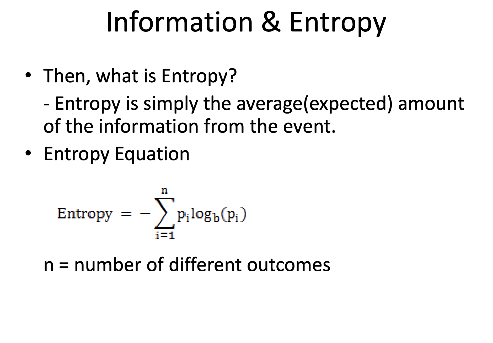

We have all used cross-entropy loss function in our classification tasks. But what is cross-entropy? How is it related to negative log-likelihood? In this post, we will try to understand the relationship between cross-entropy and negative log-likelihood. Below is an outline of the relationship between the two.

> Likelihood -> log-likelihood -> neg-log-likelihood -> cross-entropy

<u>Likelihood</u>

$$ 
\begin{equation}
\mathbb{P}(\mathcal{D}|\theta) = \prod_{i=1}^{n}\hat{y}_{\theta, i}^{y_{i}} * (1-\hat{y}_{\theta, i})^{1-y_{i}} 
\end{equation}
$$

<u>Log-Likelihood</u>

$$ 
\begin{equation}
\log(\mathbb{P}(\mathcal{D}|\theta)) = \sum_{i=0}^{n}\underbrace{y_{i}\log{\hat y_{\theta, i}}}_\text{probability of the first class} + \underbrace{(1- y_{i})\log{(1 - \hat y_{\theta, i})}}_\text{probability of the second class}
\end{equation}
$$

<u>Things to Ponder </u>
- Higher prob values would be raised to higher powers are encouraged  (more extreme version of the exponent powers?) 
- But what behaviors does multiplying the raised prob of both classes induce 
- Why do we multiply prob estimates for all the data points.

    >The reason we take the product over all the data points in the likelihood function is because we assume that the data points are independent and identically distributed (i.i.d.). This means that each data point is generated independently from the same underlying distribution, and the likelihood function measures the probability of observing all the data points given the model parameters.
    >Likelihood is basically probability of observing the whole dataset (which is the product of observing all the data points assuming data points are i.i.d.).

- When would the RHS be maximum? when all the probability is assigned to true label i.e. $$ \hat{y}_{\theta, i}=1 $$ 
- How would number the likelihood equation incorporate multiple possible classes, multivariate categorical distribution? 
- What even is distribution?? is the x that is input also part of the distribution? does it mean to look at how target labels are distributed in nd space wrt the input-variables?
- Log-likelihood only care about what probability was assigned to the correct class all other probabilities does not matter.
- Wonder what would happened in case of soft probabilistic labels? hard vs soft masking?
- In eq(1), First base term is the estimated probabilities and the exponents acts as switch and are mostly binary in case of hard labels.

---

While Training you try to minimize the cross entropy which essentially means following - 
So you basically get probability estimates for all the classes and now you can prepare likelihood of the whole batch using labels (which would help you find which class probability you need to consider, you generally consider prob of only the true class as you have y value 1 for it and zero for all other.)

And likelihood essentially means probability of the the class and log likelihood means log-probability of the true class and when you sum log-probabilities (or multiply probabilities) you get overall information gain or entropy of the estimated distribution which you want to minimize? because all useful work tend to reduce entropy.

----- 

<u>References </u>

[1] [On Information and Entropy Slides](http://www.csun.edu/~twang/595DM/Slides/Information%20&%20Entropy.pdf)

[2] [cross-entropy-negative-log-likelihood-and-all-that-jazz](https://towardsdatascience.com/cross-entropy-negative-log-likelihood-and-all-that-jazz-47a95bd2e81)

----
<!-- unpublished

 -->

