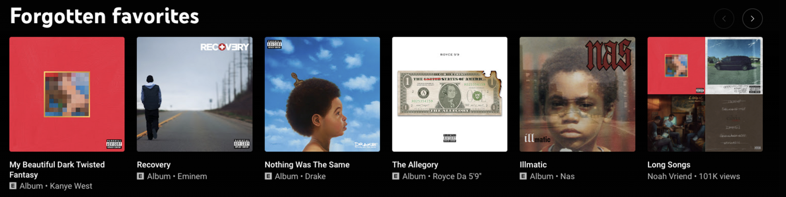

https://www.notion.so/avnishk/Music-Writeups-2c4c2a9e02da4bfcbccce736964c0abf?pvs=4

Type of recommendations

1. Short form, high velocity eg. Tiktok, Twitter 
2. Short form, low velocity eg. Wynk, Spotify 
3. Long form, high velocity eg. Youtube
4. Long form, low velocity eg. Netflix, Audible 

High velocity platform need to solve cold start problem on priority. Each will have it's own issue that needs to be solved on priority

how to use a re-ranking model like reinforcement learning?

model should learn high level desired behaviour based on the features provided?

user level models vs A single model learning all the desired behaviours.

eg learning how sensitive a use is to tod? or maybe an item is to tod?

meta features of some sort?

what if you don’t want to pass the user ID and just try to capture the user behavious with handmade features?

would if hut if you pass the userID also in conjuction with handcrafted features? Model should be able to decide on it own which feature it need to prioritise? Some user might have very distinct features which would be very easy to capture using the IDs but same might now be true for others.

I was wondering about how to make the most out of a re-ranking model using reinforcement learning. You know, the kind of model that learns from feedback and improves over time?

So, the idea is that this model should be able to understand the high-level behavior we want based on the features we provide. We could have different models for different user levels, each learning the desired behaviors separately. For example, we could train a model to understand how sensitive a user is to time of day (TOD), or maybe even how sensitive an item is to TOD.

But here's something interesting to consider: What if we don't want to pass the user ID directly and instead try to capture user behavior using manually crafted features? Would that work? I mean, can we come up with clever features that capture the essence of a user's preferences?

On the other hand, what if we combine the user ID with handcrafted features? Would the model be able to figure out which features to prioritize on its own? Some users might have distinct features that are easily captured using their IDs, but that might not be the case for everyone.

I'd love to hear your thoughts on this! Do you think it's better to have separate models for different user levels, or should we focus on handcrafted features? Maybe there are some meta features we could consider as well?

Taste Centers — New RPL/RSL clustering flow that would run once daily and power user persona and mixes.

Last high and medium intend song similarity as another feature.

Either you didn't model the user well or the user is exploring beyond that representation that you could not have modelled. This coupled with user taste center would yield great results.

Nostalgia Mixes

Active - a Mix that is prepared from the songs user used to listen to in paste. First easy to implement  solution would be to only include the mpl songs from user

- Deciding the nostalgic period — Some EDA came be performed to check how does the revisting periods looks like for different users and genres.
- Finding items forwe can just serve the exact songs user used to listen to but if would be highly inefficient one solution is to only store the taste center and retrieve the songs based on latest representation of those centers, but here we are banking on the stability of the embedding space.Implementing this nostalgic retrival efficiently is whole another task which would involve moving from mpls >> dominant mpl-pool >> taste centers >> dominant taste centers [inorder to use the taste centers first stability have to be enforced on the embedding space.] Ways to enforce stability on the embedding space - Can we initialize the embeddings with the embeddings we already have in ALS? this would ensure stability.

Passive - Autotriggering the radio to play nostalgic song — but this should already be happening? Radio should take into account the sos of the first stream.  

